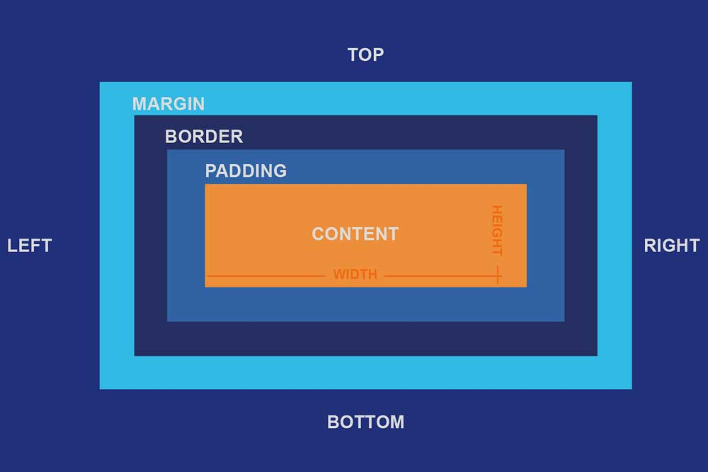

# **CSS Box Model**<br>
  
***Table of Contents***   
1.[Overview](Overview) 

2.[Content field](Content-field) 

3[Margins](margins)  
 
4.[Padding](padding)  

5.[Borders](Borders) 

6.[Box sizing](Box-sizing)

7.[Height and width](Height-and-width) 

8.[Box model diagram](Box-model-diagram)


## ***1.Overview***  
The CSS Box Model conceptualizes every HTML element as a rectangular box. The CSS box has a rectangular content area, a band of padding around the content, a border around the padding and a margin outside the border.  

## ***2.Content field***   
The content area is where the actual content of the element, such as text, images, or other media, is displayed.

It is constrained by the information edge, and its proportions are dictated by the width and height of the content enclosure.  

## ***3.Margins***  
-Margins surround the border edge of a box, providing spacing between boxes.  
-They create spacing between the element and other elements in the layout.
-Implemented using the **padding** property  
 -It's implementation is as shown below:
```css
.boxmodel{
    margin-top:20px;
      margin-right:10px;
       margin-left:20px;
        margin-bottom:10px;
}
```  
### ***-Margin Shorthand*** 
- Allows setting all four margins (top, right, bottom, left) in a single declaration.
- If fewer than four values are provided, they are applied in a clockwise rotation, starting from the top.
- Its implimentation is as follows below:
```css
.boxmodel{
    margin:20px 10px 20px 10px;
}
```
## 4.Padding
-  Padding is the space between the content of an element and its border. It creates internal space within an element.  
***Importance***  
1.Helps in improving readability and aesthetics by providing visual breathing room.  
2.Adds space around an element's content, separating it from its border and adjacent elements.

- It's implimentation is as shown below:
```css
.boxmodel{ 
   padding-top: 20px; 
   padding-right: 10px; 
   padding-left: 20px; 
   padding-bottom: 10px; 
}
```
### ***-Padding shorthand***
- The padding shorthand property is a property for setting padding-top, padding-right, padding-bottom, and padding-left in a single declaration.
- If there is only one component value, it applies to all sides. If there are two values, the top and bottom  are set to the first value and the right and left paddings are set to the second.
-  If there are three values, the top is set to the first value, the left and right are set to the second, and the bottom is set to the third.
-  If there are four values they apply to the top, right, bottom, and left paddings.
-It's implimentation is as demonstated below:
```css
.boxmodel{
     padding: 20px 10px 20px 10px
}
```
## ***5.Borders*** 
- It is a region between the padding-box and the margin. Its proportions are determined by the width and height of the boundary.
-Its implementation is as follows:
```css
.boxmodel{
     border: 2px solid ; 
    border-radius: 10px;
}
```

## ***6.Box sizing*** 
- Determines how the total width and height of an element are calculated.
-Its implementation is as shown below:
```css
.boxmodel {
    box-sizing: border-box;
}
```
## ***7.Height and width*** 
- The width and height properties include the content, padding, and border, but do not include the margin.
-Its implementation is as follows:
```css
.boxmodel {
    width: 200px;
    height: 100px;
}
```
## ***8.Box model diagram*** 



